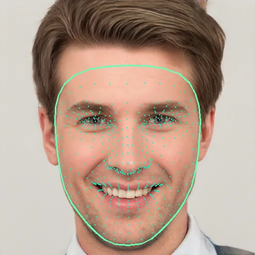

# FaceShapeAI

FaceShapeAI tells you your **face shape** from a photo (e.g., Oval, Round, Square, Heart, Oblong).

### Try it online

You can use the [working app here](https://attractivenesstest.com/face_shape).

### Use it locally (optional)

- Clone:
  - `git clone <REPO_URL>`
  - `cd FaceShapeAI`
- Install:
  - `pip install -r requirements.txt`
- Run:
  - Put a clear, front-facing photo in this folder (or use the included `sample_image.jpg`)
  - `python use_model.py your_photo.jpg`

### How it Works

FaceShapeAI scans your photo to locate a face and map a detailed set of facial points (around the eyes, nose, mouth, jaw, etc.). It then “straightens” the face a bit (so small head tilts don’t throw things off) and scales things to be more consistent across different photos. Finally, it uses the saved model in this repo to predict the most likely face shape and shows confidence scores for each option.
